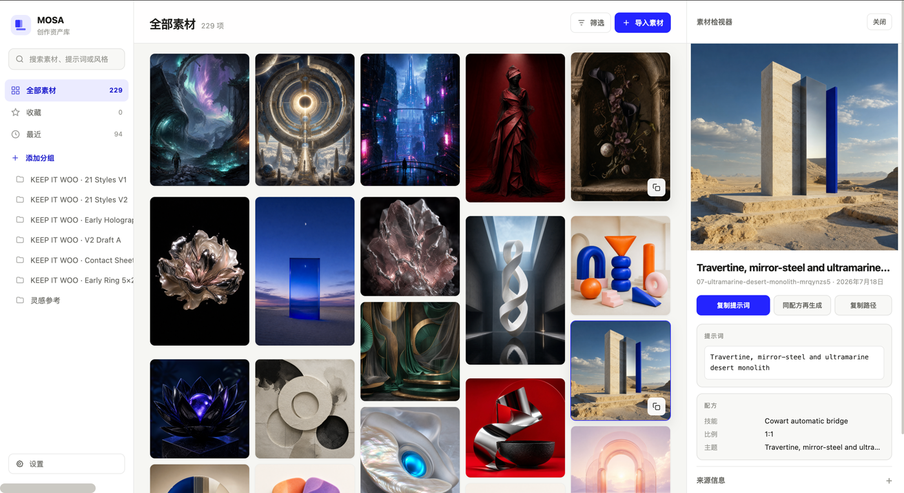

# MOSA

MOSA is a local-first creative memory library for Codex and Cowart. It keeps reusable visuals together with their complete prompts, generation context, and provenance, then makes them searchable, editable, and reusable in one local Web app.

> **Every visual, in context.** 让每一张图，都有来处，也有下一次。

> Codex images and Cowart canvas images are both monitored locally and remain traceable.

**Product walkthrough:** [Watch the 2:21 English walkthrough on YouTube](https://youtu.be/RdRtq4xfqhI).

中文简介：把可复用的图片、完整 Prompt、生成上下文和来源信息保存在同一个项目中，并提供 Web 搜索、编辑与复用入口。

## Product focus

MOSA is a local-first creative memory library. It keeps images, prompts, generation context, and provenance together so visual work can be found, inspected, refined, and reused without giving up local control.

The Codex and Cowart integrations are optional local capabilities, not account requirements. MOSA can archive generated images from Codex, synchronize explicitly registered Cowart canvases, preserve source provenance, and return library assets to the selected canvas.

The product closes the loop for visual work: create in Codex or Cowart, preserve the image with its prompt and provenance, find it again in MOSA, and reuse it on the Cowart canvas without duplicating its record.

## Install and verify

MOSA is a local-first developer tool. The complete library can be explored from the tracked sample records without an OpenAI account, Codex image credits, Cowart, or access to the author's local files.

### Supported platform

- Tested platform: macOS with Node.js and npm.
- The core Node.js service and browser UI use standard filesystem and HTTP APIs, but Windows and Linux have not yet been verified.
- Codex automatic archiving requires Codex Desktop and access to its standard local `~/.codex/generated_images/` and session directories.
- Cowart automatic archiving is optional and requires the separately installed Cowart plugin plus a configured local canvas directory.

### Install and run

```bash
git clone https://github.com/fengseekling-coder/mosa.git
cd mosa
npm ci
npm test
npm start
```

Open <http://127.0.0.1:43517>. The repository includes sample records, so the gallery, search, filters, asset detail view, prompt provenance, and source metadata can be inspected immediately. No build step, test account, API key, or external database is required.

The UI follows the system language by default. To inspect the English interface, open **Settings → Language → English** after starting MOSA.

For a quick bridge health check while the service is running:

```bash
curl -sS http://127.0.0.1:43517/api/codex-bridge
curl -sS http://127.0.0.1:43517/api/cowart-bridge
```

The optional integrations become active when their local source directories are available. They are not required to inspect or test the tracked sample data.

### Core workflow checks

1. Browse and search the included visual records in the Web app.
2. Open an asset to inspect its full prompt, source type, Codex task ID, original path, dimensions, and provenance status.
3. Run `npm test` to verify storage boundaries, route behavior, accessibility contracts, Codex reconciliation, and Cowart deduplication. The current suite has 33 passing automated tests.
4. Register a project canvas in **Settings → Cowart canvases**, then select the target canvas when inserting a library asset.

## 中文产品与集成说明

### 它如何归档图片

| 来源 | 归档方式 | 保存的信息 | 需要的前提 |
| --- | --- | --- | --- |
| Codex 生图 | 监听 `~/.codex/generated_images/`，优先以硬链接入库 | 任务 ID、原始路径、时间、文件哈希、尺寸与可用的任务提示词 | 素材管理器服务保持运行 |
| Cowart 画布 | 素材管理器服务读取已保存的 Cowart 画布快照，自动同步新页面图片 | 图片、画布描述、尺寸、画布对象与页面资产来源 | 服务保持运行；在 MOSA 设置中登记项目画布 |

Codex 自动归档的范围仅限 Codex 标准生成目录，不会扫描用户的 Downloads、桌面或其他本地图片。Cowart 只监听 MOSA 专用画布和在设置中明确登记的项目 `<项目>/canvas/`，不会扫描其他项目。

### 本地启动

前提：已安装 Node.js 与 npm。若要使用生成归档，还需要 Codex Desktop；Cowart 归档则额外需要已安装 Cowart 插件。

```bash
cd /absolute/path/to/mosa
npm ci
npm start
```

打开 <http://127.0.0.1:43517>。

服务运行期间，Codex 与 Cowart 桥接器会同时启动。请保持这个终端或将服务交给你自己的进程管理方式；停止 `npm start` 后，两种自动归档都会停止。

基础验证：

```bash
npm test
curl -sS http://127.0.0.1:43517/api/cowart-bridge
curl -sS http://127.0.0.1:43517/api/codex-bridge
```

两个状态接口中的 `enabled`、`watching` 和 `polling` 都为 `true`，表示自动归档已启用。`polling` 是文件系统没有传递变更事件时的兜底同步。

### 界面预览

**完整运行界面**



## Changelog

Product release notes are in [CHANGELOG.md](CHANGELOG.md).

## Technical documentation (中文说明)

### 一次性连接 Codex MCP

在终端注册 MCP。将路径替换成自己的绝对路径：

```bash
codex mcp add mosa \
  --env MOSA_PROJECT_DIR=/absolute/path/to/your/workspace \
  -- node /absolute/path/to/mosa/mcp/server.mjs
```

注册后新开一个 Codex 任务，使 MCP 工具加载完成。图片生成后，任务应调用 `asset_create` 并传入图像工具返回的实际 `imagePath`；同一次调用还可以传入完整 `prompt`、`generation_tool`、`model` 与 `codex_session_id`。

`asset_create` 会将文件复制到素材库，并保存：

- 原始图片路径和 Codex 任务目录 ID；
- 完整 Prompt 与配方字段；
- `generation_tool`、`model`、`codex_session_id` 等可用的生成上下文；
- 库内副本，避免 Codex 临时运行目录变化后素材丢失。

Codex 默认允许的来源目录是：

```text
~/.codex/generated_images/<task-id>/<image>.png
```

服务会在启动时校对该目录，并持续监听新增图片。对于每张图片，桥接器会按输出文件路径匹配本地 Codex 会话中的 `image_generation_end.revised_prompt`，保存图像工具实际执行的提示词；若该记录不可用，才回退为任务用户指令并明确标注状态。Codex 图片与 MOSA 库目录位于同一文件系统时，MOSA 使用硬链接，因此两个路径可用但磁盘只占一份图片数据；跨磁盘时自动降级为副本。通过 `asset_create` 手动保存时，可补充完整的模型、配方和修订提示词。

已有的复制式 Codex 素材可执行一次安全迁移：脚本会先核验两端哈希一致，再以原子替换方式转成硬链接，不会删除 Codex 原路径。

```bash
node scripts/migrate-codex-hardlinks.mjs
```

### Cowart 自动归档

启动素材管理器后，内置桥接器会始终监听 MOSA 专用画布：

```text
~/.codex/cowart-data/mosa/pages/
```

Cowart 在这个目录保存画布后，新生成的图片、AI 图片框替换结果和批注编辑结果都会自动入库。桥接器以 Cowart 画布快照中的页面资产路径去重；从素材管理器插回画布的图片会携带来源 ID，桥接器会跳过它，避免重复归档。

要归档其他项目的画布，在 MOSA 的 **设置 → Cowart 画布** 中填入该项目的绝对路径。MOSA 会只监控该项目的 `<项目>/canvas/`，项目之间仍保持各自的 Cowart 画布；已登记列表保存在 `~/.codex/mosa/cowart-projects.json`，服务重启后仍会生效。MOSA 不会自动扫描或收集未登记项目的画布。

Cowart 快照仅提供画布描述（alt text），不保存完整生图 Prompt。因此 Cowart 自动归档的素材会明确标记为 `canvas-alt-text-only`；需要完整 Prompt 时，可在详情页后补或从原生成任务补录。

常用的 Codex 工作流：

- **“启动 MOSA”**：运行本地素材库并打开 Web App。
- **“启动画布”**：打开 Cowart 的原生 Codex 画布。
- **“把当前素材插入画布”**：先通过 `asset_get` 读取素材，再插入 Cowart，并携带 MOSA 来源 ID 防重。

素材详情页也提供 **“插入 Cowart”** 按钮。MOSA 会调用本机已安装 Cowart 插件的 `insert_cowart_image` 工具，将素材放入当前 Cowart 页面，并写入 `mosaAssetId` 防止桥接器再次归档同一素材。该按钮要求 Cowart 插件已安装且目标画布至少保存过一次；插件不可用时按钮会明确禁用。

Cowart 是外部 Codex 插件，运行数据刻意保存在仓库外，不会被复制或提交进本项目。首次安装或升级 Cowart 后，请新开一个 Codex 任务以加载其 MCP 工具。

#### 配置 MOSA 专用画布

默认 MOSA 专用画布目录名为 `mosa`。若要为这个专用画布使用其他外部目录，请在启动服务时显式指定：

```bash
COWART_MOSA_CANVAS_DIR=/absolute/path/to/cowart-data/my-project npm start
```

这个环境变量只改变 MOSA 专用画布。其他项目画布请通过设置菜单登记，而不是通过扫描机器上的目录。

### 最短端到端验证

1. 运行 `npm start`，打开 Web App。
2. 新开任意 Codex 任务（不需要关联 MOSA 项目）。
3. 生成一张图片；在 Web 中等待最多 3 秒，确认出现 **Codex** 来源的新素材、任务 ID、原始路径与提示词状态。
4. 若使用普通项目画布，先在 **设置 → Cowart 画布** 登记项目根目录；然后打开该项目的 Cowart 画布，生成、替换或批注编辑一张图片并保存画布。
5. 等待最多 2 秒，回到 Web 查看带有 **Cowart** 来源标记的新素材；也可访问 `/api/cowart-bridge` 查看同步状态。
6. 将一张库内素材插回画布，确认素材总数没有因同一文件再次增加。

### 可配置项

| 环境变量 | 默认值 | 用途 |
| --- | --- | --- |
| `MOSA_PROJECT_DIR` | MOSA 目录的父目录 | 工作区根目录，用于确定项目上下文 |
| `MOSA_PORT` | `43517` | Web 服务本地端口 |
| `CODEX_GENERATED_IMAGES_DIR` | `~/.codex/generated_images` | 允许 `asset_create` 读取的 Codex 图片来源根目录 |
| `CODEX_SESSIONS_DIR` | `~/.codex/sessions` | 用于读取对应 Codex 任务提示词的会话记录根目录 |
| `COWART_MOSA_CANVAS_DIR` | `~/.codex/cowart-data/mosa` | MOSA 专用 Cowart 画布数据目录 |
| `MOSA_COWART_REGISTRY_PATH` | `~/.codex/mosa/cowart-projects.json` | 已登记项目画布列表；每项只监听 `<项目>/canvas/` |
| `COWART_MCP_SERVER_PATH` | `~/plugins/cowart/mcp/server.mjs` | 可选的 Cowart MCP 服务入口，用于 Web 中的一键插入 |

### 本地数据结构

```text
mosa/
├── assets/
│   └── default/
│       ├── images/       # 素材库图片副本
│       ├── prompts/      # 可编辑的 Prompt 文本
│       └── metadata/     # JSON 元数据与来源信息
├── app/                  # 本地 Web UI
├── lib/                  # 素材存储与 Cowart 桥接器
└── mcp/                  # Codex MCP 服务
```

Cowart 运行数据不在仓库中：

```text
~/.codex/cowart-data/mosa/             # MOSA 专用画布
~/.codex/mosa/cowart-projects.json     # 已登记项目根目录
```

#### Git 与本地素材

素材库的运行期图片、Prompt 与元数据保存在本地 `assets/<project>/` 下，但新的归档记录默认被 `.gitignore` 忽略，避免每次 Codex 或 Cowart 生成图片都弄脏工作区。仓库中已经跟踪的素材仅作为演示样例；如果要把某个新素材作为正式样例提交，请确认不含敏感内容后显式执行：

```bash
git add -f assets/default/images/<asset>.png \
  assets/default/prompts/<asset>.md \
  assets/default/metadata/<asset>.json
```

本地 HTTP 服务只接受同源浏览器请求，不应通过远程网页、反向代理或公网端口暴露。

### MCP 工具

- `asset_create`
- `asset_list`
- `asset_get`
- `asset_update_metadata`
- `asset_attach_prompt`

可以直接在仓库父目录运行 MCP 服务进行本地调试：

```bash
cd /absolute/path/to/your/workspace
node mosa/mcp/server.mjs
```

### 当前边界

- 数据以本地文件保存，第一版不使用数据库或云同步。
- Codex 图片归档在素材管理器服务运行时自动监听标准生成目录；MCP `asset_create` 可用于显式保存和补充生成元数据。
- Cowart 自动归档依赖素材管理器服务运行，并且只覆盖 MOSA 专用画布和明确登记的项目画布。
- Cowart 自动归档保留画布描述，不具备完整 Prompt；原始 Prompt 需要从生成任务补录。
- “同配方再生成”当前复制 Codex 指令，不直接调用图像模型。

### 核心流程验证

1. 展示真实 Codex `image_generation_end` 记录，以及监听器无需点击 Import 即自动归档完整 Prompt 与来源。
2. 展示 Cowart 中生成或编辑图片后，无需额外入库指令即出现在素材库。
3. 在 Web 中搜索素材，打开详情页展示 Prompt、配方和来源。
4. 将库内素材插入已选择的 Cowart 画布，展示去重保护与可复用性。

## License

MOSA is available under the [MIT License](LICENSE).
